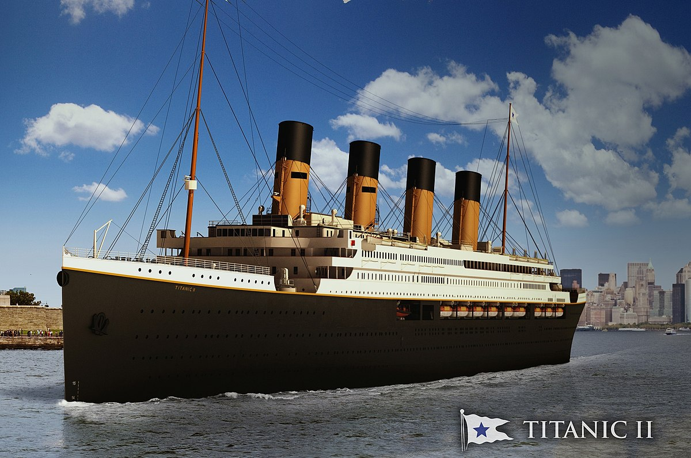

# titanic

Exploratory Data Analysis on Titanic Dataset

Dataset: https://www.kaggle.com/datasets/wenruliu/adult-income-dataset

#About Dataset:

##Features of the dataset: 

- survival - Survival (0 = No; 1 = Yes)
- class - Passenger Class (1 = 1st; 2 = 2nd; 3 = 3rd)
- name - Name
- sex - Sex
- age - Age
- sibsp - Number of Siblings/Spouses Aboard
- parch - Number of Parents/Children Aboard
- ticket - Ticket Number
- fare - Passenger Fare
- cabin - Cabin
- embarked - Port of Embarkation (C = Cherbourg; Q = Queenstown; S = Southampton)

##Questions :
1. Display Top 5 Rows of The Dataset
2. Check the Last 3 Rows of The Dataset
3. Find Shape of Our Dataset (Number of Rows & Number of Columns)
4. Get Information About Our Dataset Like Total Number Rows, Total Number of Columns, Datatypes of Each Column And Memory Requirement
5. Get Overall Statistics About The Dataframe
6. Data Filtering
7.Check Null Values In The Dataset
8. Drop the Column
9. Handle Missing Values
10. Categorical Data Encoding
11. What is Univariate Analysis?
How Many People Survived And How Many Died?
How Many Passengers Were In First Class, Second Class, and Third Class?
Number of Male And Female Passengers
12. Bivariate Analysis
How Has Better Chance of Survival Male or Female?
Which Passenger Class Has Better Chance of Survival (First, Second, Or Third Class)? 
13. Feature Engineering
